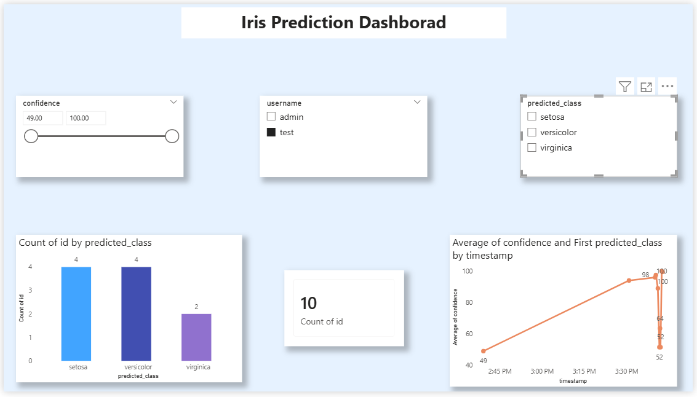

# iris-flower-classifiction-dashboard
“Flask-based ML dashboard for Iris dataset with Power BI integration.”

# 🌸 Iris Prediction Project

A machine learning-powered web application that predicts iris flower species and provides interactive dashboards with Power BI integration.

---

## 🚀 Features

### 🔮 Prediction Interface
- Submit iris measurements to get predicted species
- Shows prediction class, confidence score, and timestamp

### 📜 Prediction History
- View all past predictions with class and confidence
- Organized for easy tracking and analysis

### 📊 Dashboard Overview
- Total predictions made
- Last prediction summary
- Dropdown to access:
  - 📊 Analytics
  - 📈 Power BI Dashboard

### 📈 Power BI Dashboard
- Accessible via `/powerbi` route
- Visualizes:
  - Class distribution
  - Confidence trends
  - Prediction evolution over time
  - Multiple chart types (bar, line, pie, scatter)

### 🧠 Model Info
- View model details and training insights
- Understand how predictions are generated

### 📂 Dataset Explorer
- Explore the Iris dataset used for training
- View sample data and structure

---

## 🖥️ Tech Stack
- **Frontend:** HTML, CSS (Inter font, custom layout)
- **Backend:** Python, Flask
- **Visualization:** Power BI (published and embedded)
- **Data:** Iris dataset (sepal/petal measurements)

---

## 📁 Folder Structure

IRIS_FLOWER_CLASS/ 
│ ├── backend/
│ ├── templates/
│ │ └── admin/ 
│ │ ├── dashboard.html
│ │ ├── powerbi.html
│ │ ├── analytics.html
│ │ ├── history.html
│ │ ├── model_info.html 
│ │ ├── dataset.html
│ │ ├── profile.html 
│ │ ├── settings.html
│ │ └── help.html
│ ├── iris.csv
├── iris_dashboard.pbix 
├── app.py
├── train_model.py
├── db_test.py 
├── requirements.txt 
── README.md

---

## 🔗 Navigation Routes
| Route         | Description                        |
|---------------|------------------------------------|
| `/dashboard`  | Main dashboard summary             |
| `/predict`    | Submit new prediction              |
| `/history`    | View prediction history            |
| `/powerbi`    | View Power BI dashboard preview    |
| `/dataset`    | Explore training dataset           |
| `/model`      | View model information             |

---

## 📷 Dashboard Preview

---

## 📝 License
This project is licensed under the MIT License.

---

## 🙋‍♀️ Author
**SANIKA Patil**  
Persistent learner, passionate about clean UI, visual clarity, and professional polish in machine learning dashboards.

## 🌼 Iris Prediction Dashboard

This dashboard visualizes predictions from a machine learning model trained to classify iris flower species. Built using Power BI, it provides interactive insights into prediction confidence, class distribution, and user-specific data.

### 🔍 Dashboard Features
- **Total Predictions Card** – Shows the total number of predictions made.
- **Confidence Filter** – Filter predictions by confidence score.
- **Predicted Class Slicer** – Focus on Setosa, Versicolor, or Virginica.
- **Bar Chart** – Displays count of predictions per class.
- **Line Chart** – Shows average confidence per class over training steps.
- **Prediction Table** – Lists individual predictions with confidence scores.

### 🎨 Design Highlights
- Clean layout with aligned visuals and soft background
- Consistent fonts and color palette
- Interactive slicers and tooltips
- Subtle borders and spacing for professional polish

### 📷 Dashboard Preview

